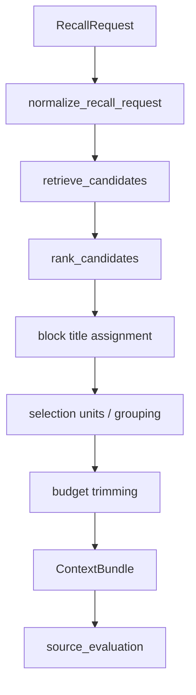

# Recall / Context Builder Design

## 目的

この設計は、`gemma-lab` における `M3: Recall / Context Builder` の現行仕様と、ここから先の拡張余地を整理するための文書です。

狙いは明快です。

- 記録した作業ログを、ただの保存庫で終わらせない
- その場のタスクに効く形で、素早く、説明可能に思い出せるようにする
- review / design / proposal / failure_analysis ごとに、使い道の異なる文脈束を安定して返す

この文書は構想メモではなく、いまの実装に追随した設計書として扱う。
理想像だけでなく、すでに入っている判断も明示する。

## この設計が先に立つ理由

いまの repo には、すでに Recall の土台がある。

- `scripts/software_work_events.py`
- `scripts/memory_index.py`
- `scripts/rebuild_memory_index.py`
- `scripts/recall_context.py`
- `scripts/prepare_recall_real_data.py`
- `scripts/run_recall_demo.py`

なので次の一手は、保存方式を増やすことではありません。
実務で使える取り出し方を整え、評価し、調整し続けられる回路を固めることです。

これが弱いままだと:

- 記憶は増えても使われない
- 毎回ゼロから考え直す
- 良い提案も悪い失敗も次の判断に効かない
- 後段の評価ループや学習候補抽出が弱くなる

Recall / Context Builder は、記録を判断力に変える最初のレイヤーです。

## 設計原則

この機能では、次の性質を優先する。

- local first
- lexical first
- explainable first
- small sharp surface
- stable output shape

言い換えると、最初から派手な賢さを狙うのではなく、速く、見通しがよく、触るほど馴染む設計を優先する。

特に大事なのは次の 3 点です。

1. 返ってきた候補に理由が付いていること
2. 長さが暴れず、同じ request でだいたい同じ形に落ちること
3. 失敗時に、なぜ拾えなかったかを後から診断できること

## 非目的

この段階では次を必須にしない。

- vector search の常用
- learned re-ranker の導入
- judge model での回答品質自動採点
- 外部検索基盤や graph DB の導入
- UI 側の大規模な先行投資
- token 単位の厳密制御

まずはローカルで回り、壊れても直しやすく、改善の打ち手が見えることを優先する。

## 対象ユースケース

最初の task kind は 4 つに絞る。

1. `review`
   - 類似レビュー
   - 過去の修正パターン
   - 見落としやすいリスク

2. `design`
   - 過去の設計判断
   - tradeoff の残り方
   - 採用理由と却下理由

3. `proposal`
   - 類似提案
   - 受け入れられた提案文
   - outcome や test pass に繋がった流れ

4. `failure_analysis`
   - `quality_fail`
   - `failed`
   - `blocked`
   - repair / follow-up の履歴

## システムの責務

Recall / Context Builder の責務は 4 つです。

1. request を正規化する
2. index から候補を広めに回収する
3. タスクに応じて候補を並べ替える
4. 予算内で grouped context bundle に組み立てる

逆に、この層の責務ではないものも明確にしておく。

- source event の生成
- index schema の定義そのもの
- 最終回答の生成
- 評価 UI の描画

## アーキテクチャ概要



補助的な評価ループは次のモジュールで支える。

- `prepare_recall_real_data.py`
  - 実データから prepared request を生成する
- `run_recall_demo.py`
  - dataset evaluation
  - miss report
  - previous/current diff

## 入力契約

### RecallRequest

`RecallRequest` は最低限次を持つ。

```python
{
  "task_kind": "review",
  "query_text": "review the memory index patch",
  "request_basis": "prompt-or-artifact",
  "file_hints": ["scripts/memory_index.py"],
  "surface_filters": ["chat", "thinking"],
  "status_filters": ["ok", "quality_fail"],
  "pinned_event_ids": ["event-123"],
  "limit": 12,
  "context_budget_chars": 6000,
  "source_event_id": "event-456",
}
```

#### 主要フィールド

- `task_kind`
  - `review`
  - `design`
  - `proposal`
  - `failure_analysis`
- `query_text`
  - 検索とランキングの中心になる文字列
- `request_basis`
  - いまは主に `prompt-or-artifact` と `pass_definition`
- `file_hints`
  - path match を強く見るための補助ヒント
- `surface_filters`
  - `chat`, `thinking`, `evaluation` など
- `status_filters`
  - 明示指定があれば retrieval 側で適用
- `pinned_event_ids`
  - query に乗らなくても候補として必ず参照したい event
- `source_event_id`
  - recall quality を計測するための正解 source

#### 正規化ポリシー

- `task_kind` は lower-case へ正規化
- 空文字や重複は落とす
- `limit` と `context_budget_chars` は正の整数に矯正
- 不正な `task_kind` は例外にする

## 出力契約

### ContextBundle

出力は検索結果の配列ではなく、用途別に束ねた context bundle とする。

```python
{
  "bundle_version": 6,
  "task_kind": "review",
  "query_text": "review the memory index patch",
  "request_basis": "prompt-or-artifact",
  "file_hints": ["scripts/memory_index.py"],
  "surface_filters": [],
  "status_filters": [],
  "pinned_event_ids": [],
  "selected_count": 3,
  "omitted_count": 7,
  "budget": {
    "context_budget_chars": 6000,
    "effective_context_budget_chars": 6000,
    "used_chars": 4210,
  },
  "selected_candidates": [...],
  "blocks": [...],
  "source_evaluation": {...},
}
```

### Selected Candidate

`selected_candidates` は最上位候補の参照情報を持つ。

```python
{
  "event_id": "event-123",
  "score": 23.4,
  "reasons": ["fts-hit", "file-match", "accepted-signal"],
  "evidence_types": ["source-artifact", "accepted"],
  "evidence_priority": {
    "task_kind": "review",
    "matched_evidence_types": ["source-artifact", "accepted"],
    "score": 5.0,
  },
  "event_contract_status": "ok",
  "source_artifact_status": "readable",
  "block_title": "Related files and artifact paths",
  "status": "ok",
  "recorded_at_utc": "2026-04-13T10:00:00+00:00",
  "session_id": "chat-main",
  "session_surface": "chat",
  "event_kind": "chat_turn",
  "artifact_path": "artifacts/review/leader.json",
  "prompt_excerpt": "Review scripts/memory_index.py patch for regressions.",
}
```

pass definition ベースの request では、複数 event を 1 つの selection unit に束ねることがある。
そのときは次の情報が追加される。

- `grouped_by`
- `group_member_count`
- `group_member_event_ids`
- `group_member_labels`

### Source Evaluation

`source_event_id` がある場合、bundle は recall quality 計測のための補助情報を返す。

```python
{
  "source_event_id": "event-456",
  "source_selected": True,
  "source_rank": 2,
  "source_score": 18.1,
  "source_block_title": "Accepted outcomes",
  "source_prompt_excerpt": "Review the memory index patch.",
  "source_reasons": ["fts-hit", "accepted-signal"],
  "source_candidate_pool_status": "selected",
  "source_evidence_types": ["source-artifact", "accepted"],
  "source_evidence_priority": {...},
  "source_evidence_type_match": True,
  "source_event_contract_status": "ok",
  "source_artifact_status": "readable",
  "source_artifact_reasons": [],
  "source_selected_via_group": False,
  "source_group_member_count": None,
  "source_grouped_by": None,
  "source_group_event_id": None,
  "source_group_prompt_excerpt": None,
  "source_group_member_event_ids": [],
  "source_group_member_labels": [],
  "miss_reason": None,
  "miss_reason_detail": None,
  "miss_diagnostics": [],
  "source_exists_in_index": True,
  "selected_count": 3,
  "top_selected": [...],
}
```

`source_selected_via_group` は、source 自身が selected candidate の代表ではなく、選ばれた group の member として拾われた場合に `True` になる。
source が group の代表 candidate になった場合は `False` のまま、`source_grouped_by` と `source_group_member_count` で group 情報を確認する。

主な `miss_reason` は次です。

- `not_retrieved`
- `ranked_out_by_limit`
- `dropped_by_context_budget`
- `dropped_by_block_budget`
- `source_missing_from_index`
- `source_event_contract_broken`
- `evidence_type_mismatch`

## 処理フロー

### 1. Query Intake

`normalize_recall_request(...)` で request を `RecallRequest` に揃える。

ここで大事なのは、query の美しさではなく、後段が迷わず動ける形にすることです。

### 2. Candidate Retrieval

`retrieve_candidates(...)` は `MemoryIndex.search(...)` を使って候補を回収する。

検索の考え方は次の通り。

- `SQLite FTS5` を第一段にする
- surface ごとに回す
- status ごとに回す
- query を複数形に展開して oversample する
- broad search も混ぜて取りこぼしを減らす

#### 検索対象

index 側で参照される主な列は次。

- `prompt`
- `output_text`
- `notes_text`
- `pass_definition`
- `artifact_path`
- `event_kind`
- `session_surface`
- `session_mode`
- `model_id`
- `status`

#### Query の組み立て

通常 request:

- `query_text` から token query を作る
- `file_hints` からも補助 query を作る
- 最後に broad search を 1 回混ぜる

`request_basis == "pass_definition"` の request:

- phrase query を最初に投げる
- token query を併用する
- broad search は混ぜない
- context budget は通常より広げる

#### Oversample の意図

選択前に十分な母集団を持つため、retrieval 時の `limit` は最終 `limit` より広く取る。
これは ranking と budget trim の仕事を成立させるための前提です。

### 3. Ranking

`rank_candidates(...)` は learned ranker ではなく、明示的な加点減点で候補を並べる。

主な要素は次。

- `fts-hit`
- `multi-query-hit`
- `file-match`
- `exact-query-match`
- `query-phrase-match`
- `query-coverage`
- `query-head-match`
- `query-head-mismatch`
- `validation-command-match`
- `validation-command-mismatch`
- `task-affinity`
- `priority:<task_kind>:<evidence_type>`
- `accepted-signal`
- `failure-signal`
- `repair-signal`
- `risk-signal`
- `recent`
- `pinned`
- `source-contract-broken`

#### ranking の思想

- review では file hit と accepted outcome を強めに見る
- task kind ごとの evidence priority を `priority:review:accepted` のような reason tag に残す
- failure_analysis では failure / repair を前に出す
- source artifact / event contract に戻れない event は、候補には残しても selected evidence としては採用しない
- pass definition request では exact phrase hit を強く見る
- pinned event は inspection 用に candidate pool へ注入するだけで、ranking score の昇格には使わない
- capability matrix 由来の pipe-delimited query では head anchor と `--only ...` の一致を見る

この設計の良いところは、外したときに理由を追えることです。
逆に弱点もはっきりしていて、言い換えや意味類似にはまだ強くない。

### 4. Block Assignment

ranking 後、各 candidate は block に振り分けられる。

block title は現在次の 5 種です。

- `Relevant prior prompts`
- `Accepted outcomes`
- `Failure and repair patterns`
- `Related files and artifact paths`
- `Open risks`

task kind ごとに block の優先順は変わる。

- `review`
  - files -> accepted -> failure -> relevant -> risks
- `design`
  - accepted -> relevant -> failure -> files -> risks
- `proposal`
  - relevant -> accepted -> failure -> files -> risks
- `failure_analysis`
  - failure -> accepted -> files -> relevant -> risks

### 5. Selection Unit Grouping

通常は 1 candidate = 1 selection unit です。
ただし `request_basis == "pass_definition"` で `event_kind == "capability_result"` のときは、同じ `pass_definition` を共有する candidate 群を 1 つに束ねる。

この grouping の意図は 2 つあります。

- capability matrix 系の重複をそのまま並べない
- source hit を「個別 event」ではなく「同じ合格条件の束」としても把握できるようにする

### 6. Budget Control

`build_context_bundle(...)` は char budget ベースで bundle を切り詰める。

現在の制御は二段です。

1. bundle 全体の `effective_context_budget_chars`
2. block ごとの budget ratio

block budget は task kind ごとに固定比率を持つ。
これにより、1 ブロックだけで context を食い潰しにくくしている。

候補が落ちる理由は明示する。

- `ranked_out_by_limit`
- `dropped_by_context_budget`
- `dropped_by_block_budget`
- `source_event_contract_broken`
- `evidence_type_mismatch`

ここはかなり大事です。
Recall が弱いのか、Ranking が悪いのか、Budget がきついのかを分けて見られないと、改善が鈍るからです。

## 実装モジュール

### `scripts/recall_context.py`

責務:

- request normalization
- query construction
- candidate retrieval
- heuristic ranking
- block assignment
- pass-definition grouping
- context budget trimming
- source evaluation

### `scripts/prepare_recall_real_data.py`

責務:

- 実 event から prepared request を作る
- baseline request を作る
- adversarial pass-definition request を作る
- bundle snapshot を保存する
- dataset に source hit 情報を埋める

### `scripts/run_recall_demo.py`

責務:

- prepared request 一覧
- dataset evaluation
- miss report
- previous/current diff
- bundle の text/json 出力

## 評価ループとの接続

Recall は「作ったら終わり」ではなく、「source hit を計測しながら絞る」前提で設計する。

評価ループの詳細は `docs/recall_hit_quality_loop.md` に譲るが、この設計と接続する要点は次です。

- prepared request ごとに `source_event_id` を持つ
- bundle に `source_evaluation` を埋める
- evaluation summary で hit rate を集計する
- variant ごとの差分を比較する
- miss reason ごとに次の打ち手を考えられる

variant は現時点で次を持つ。

- `baseline`
- `adversarial-pass-definition`

## 完了済みの仕様

現時点で、少なくとも次はすでに設計から実装へ落ちている。

- 4 task kind の分岐
- request normalization
- lexical retrieval
- file hint matching
- explainable reason tags
- task-aware block ordering
- char budget trimming
- source hit / miss の計測
- pass-definition request の phrase-first retrieval
- same pass-definition grouping
- pinned event の注入
- pinned event compare による通常 ranking との差分診断
- task kind ごとの evidence priority reason
- source artifact / event contract broken candidate の除外
- evaluation summary の記録
- source が pass-definition group 経由で選ばれたときの group metadata 記録

ここは素直に強いです。
発想だけでなく、すでに検証可能な形になっている。

## 未解決課題

ただし、まだ甘いところもある。

1. semantic recall は弱い
   - FTS と rule base が中心なので、言い換えにまだ弱い

2. schema 依存が高い
   - `notes_text`, `status`, `pass_definition` の品質に引っ張られる

3. char budget は token budget より粗い
   - LLM 実消費とのズレが残る

4. task labeling はまだ heuristic
   - prepared request 生成時の `task_kind` 推定は完全ではない

5. grouped output の説明はまだ軽量
   - source group metadata と CLI / UI の member label 表示は入った
   - ただし member ごとの詳細比較や rich diagnostics はまだ次段でよい

## 今後の拡張方針

次の拡張は、いまの説明可能性を壊さない順で入れる。

### Phase 1

- query rewrite の小改善
- file hint の自動補完
- status / surface の既定値の見直し
- summary 文字列の整形改善

### Phase 2

- optional vector fallback
- lexical + semantic の hybrid retrieval
- miss reason ごとの suggested tweak 強化

### Phase 3

- learned re-ranker の検討
- token-aware budget への移行
- user-facing diagnostics の洗練

## Done の定義

この設計の Done は次。

- `RecallRequest` から `ContextBundle` まで一通り通る
- 4 task kind で block ordering と ranking が変わる
- なぜ拾ったかを `reasons` で説明できる
- 落ちた理由を `miss_reason` で追える
- prepared request と evaluation summary が同期する
- pass-definition request を通常 request と分けて扱える
- テストで ranking / budget / grouping / source evaluation を確認できる

## 今回の締め範囲

この M3 checkpoint では、次を完成ラインとして扱う。

- local SQLite / FTS5 を使った lexical recall
- reason tag で説明できる rule-based ranking
- task kind ごとの block assembly
- prepared request dataset による source-hit 評価
- CLI と Local UI で同じ dataset / bundle / evaluation summary を読む流れ
- manual recall と pinned event compare で miss を診断できる導線
- pass-definition group の代表候補と member labels を CLI / UI で追える表示

逆に、次は M3 の完了条件に含めない。

- semantic / vector recall
- learned re-ranker
- token-aware budget
- answer usefulness の自動 judge
- 外部検索基盤や大規模 dashboard

ここを分けるのが重要です。
いま必要なのは Recall を賢く見せることではなく、外したときに人間が直せる状態で締めることです。

## 結論

Recall / Context Builder は、この repo を単なる作業ログ置き場から、過去判断をちゃんと再利用できる開発基盤へ進める中心レイヤーです。

いまの設計は、背伸びした賢さより、実務での手触りを優先している。
その判断は正しいです。

次に磨くべきは方向性ではなく、診断しやすさと取りこぼしの減らし方です。
そこまで見えているので、かなり良い地点に来ています。

## 10分レビュー用チェックリスト

この文書と実装を 10 分で見直すなら、次だけ回せば十分です。

### 1. 入力契約

- `task_kind` の 4 種が文書と実装で一致しているか
- `request_basis`, `pinned_event_ids`, `source_event_id` が設計書に明記されているか
- default 値の説明が、実装の `DEFAULT_LIMIT` / `DEFAULT_CONTEXT_BUDGET_CHARS` とズレていないか

### 2. Retrieval

- `pass_definition` request だけ phrase-first になっている説明があるか
- broad search を使う条件が文書で曖昧になっていないか
- 検索対象列に `pass_definition` が漏れていないか

### 3. Ranking

- `file-match`, `accepted-signal`, `failure-signal`, `pinned` など主要 reason tag が文書にあるか
- review と failure_analysis の優先度差が説明されているか
- query head / validation command の一致判定が必要十分に書かれているか

### 4. Assembly

- 5 つの block title が実装と一致しているか
- task kind ごとの block 順序が合っているか
- pass-definition grouping の条件と意図が書けているか

### 5. Budget / Miss

- `ranked_out_by_limit`, `dropped_by_context_budget`, `dropped_by_block_budget`, `source_missing_from_index` が明記されているか
- `effective_context_budget_chars` の存在が説明されているか
- char budget の粗さを既知の制約として認めているか

### 6. 評価ループ

- `source_evaluation` の役割が説明されているか
- prepared request -> evaluation -> diff の流れが途切れず読めるか
- `baseline` と `adversarial-pass-definition` の 2 variant が文書に残っているか

### 7. 最後のひと押し

- この文書を読んだ人が「次にどこを触ればよいか」を 30 秒で言えるか
- 実装済みのことと、未実装の理想が混ざっていないか
- 読後に「賢そう」ではなく「直せそう」と感じるか
