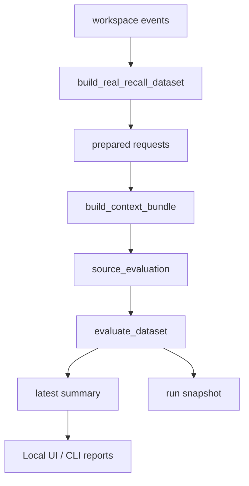

# Recall Hit Quality Loop

## 目的

Recall は、候補を何件か見て「たぶん良さそう」と感じるだけでは改善が鈍る。

必要なのは次の 2 つです。

- 今の recall が source event をどれくらい回収できているかを、すぐ測れること
- miss を見つけて、軽く調整して、もう一度回す往復が小さな手数で済むこと

この文書は、`gemma-lab` の現行実装に沿って、その軽量評価ループを定義する。
理想論よりも、いま実際に回る流れを中心に書く。

## なぜこのループが必要か

Recall / Context Builder が返す bundle は、単体で見ればそれなりに良く見えてしまう。
でも、それだけでは次が見えにくい。

本当に必要なのは次です。

- source を拾えたか
- 拾えなかったなら retrieval / ranking / budget のどこで落ちたか
- 前回より良くなったのか、悪くなったのか
- baseline と adversarial request で弱点がどこにあるか

このループは、Recall を「気分で触る対象」から「差分で詰める対象」に変えるためのものです。

## 設計原則

この評価ループでは次を優先する。

- local first
- source-hit first
- reusable snapshots
- CLI and Local UI share one truth
- diagnosis before complexity

重い judge model や learned re-ranker を先に足すのではなく、まず今の retrieval がどこで外しているかを見えるようにする。

## システムの責務

このループの責務は 5 つです。

1. 実データから prepared request を作る
2. 各 request について bundle を再評価する
3. source hit / miss を集計する
4. miss の理由を一覧し、前回との差分を残す
5. CLI と Local UI が同じ保存物を参照できるようにする

逆に、このループの責務ではないものも明確にしておく。

- 回答品質そのものの最終採点
- learned re-ranker の学習
- 自動での重み調整適用
- 大規模ダッシュボード基盤

## アーキテクチャ概要



中心になるモジュールは次です。

- `scripts/prepare_recall_real_data.py`
- `scripts/run_recall_demo.py`
- `scripts/run_local_ui.py`
- `scripts/recall_context.py`

## ループの全体像

実際のループは次の順で回る。

1. workspace event から prepared request を生成する
2. request ごとに context bundle を作る
3. bundle 内の `source_evaluation` から hit / miss を読む
4. request 単位の評価 row を作る
5. variant 別 summary と miss reason 集計を作る
6. `latest.json` と run snapshot を保存する
7. Local UI か CLI で miss を見て、manual recall や pin compare に流す
8. parameter を少し変えて、もう一度評価する

ここで大事なのは、1 回ごとのループが小さいことです。
大きな判断を後回しにして、まず miss の場所を特定できることに価値がある。

## 中核データの考え方

このループには、似ているけれど役割の違う 3 種のデータがある。

### 1. Prepared Request Dataset

prepared request dataset は、評価対象の request 一覧です。

保存先:

- `artifacts/recall_data/<workspace>/real_recall_dataset.json`

役割:

- どの request を評価対象にするかを固定する
- source event を request に結びつける
- request ごとの bundle path と直近評価結果を保持する

### 2. Bundle Snapshot

各 prepared request から作った bundle を保存する。

保存先:

- `artifacts/recall_data/<workspace>/bundles/*.json`

役割:

- request 単位の個別結果をあとから追えるようにする
- source がなぜ落ちたかを bundle レベルで見直せるようにする
- Local UI で selected candidates や compare に使う

UI からの manual recall や pin compare は別保存物として次にも出る。

- `artifacts/recall_data/<workspace>/ui/*.json`

### 3. Evaluation Summary

prepared requests 全体の評価結果を集約した summary です。

保存先:

- latest evaluation
  - `artifacts/recall_data/<workspace>/evaluation/latest.json`
- run snapshots
  - `artifacts/recall_data/<workspace>/evaluation/runs/*.json`

役割:

- hit rate の現況把握
- previous / current / delta の比較
- miss list の供給
- Local UI と CLI の共通ソース

## Prepared Request の生成

prepared request は `build_real_recall_dataset(...)` が作る。

入力ソース:

- workspace events
- capability matrix events

この関数は次を行う。

1. memory index を rebuild する
2. event を新しい順で並べる
3. baseline request を作る
4. 一部の request から adversarial pass-definition request を追加する
5. request ごとに bundle を先に作り、初回の source hit 情報を埋める
6. dataset を保存する

### Baseline Request

baseline request は、event の prompt / output / artifact hint から自然に引ける query を作る。

特徴:

- `request_variant = baseline`
- `request_basis = prompt-or-artifact`
- file hint があれば付ける
- まず実務寄りの request を広く拾う

### Adversarial Pass-Definition Request

adversarial request は、`capability_result` 由来の event に対して追加される。

特徴:

- `request_variant = adversarial-pass-definition`
- `request_basis = pass_definition`
- pass definition を query に使う
- baseline では拾いにくい shared contract の弱点を見る

ここを入れているのは良い判断です。
baseline だけだと「普通の query では良さそう」に見えてしまい、shared pass definition 系の弱さが埋もれるからです。

## 評価単位

このループの最小評価単位は「prepared request 1 件」です。

各 request について bundle を再取得し、その `source_evaluation` から評価 row を作る。

重要な点は、dataset 側の `source_hit` は bundle 側の `source_evaluation.source_selected` を転記したものだということです。

つまり:

- bundle は事実の近い一次結果
- dataset はその集約済みカタログ
- evaluation summary は全体集計

という役割分担になる。

## 中核指標

最初の軽量指標は source hit を中心にする。

### Request-level Metrics

- `source_hit`
  - prepared request の source event が最終 selected bundle に入ったか
- `source_rank`
  - ranked 候補の中で source が何位だったか
- `source_score`
  - source candidate の score
- `selected_count`
  - 実際に bundle へ採用された数
- `omitted_count`
  - limit や budget で落ちた数
- `source_block_title`
  - source がどの block に分類されたか
- `source_reasons`
  - source に付いた ranking reason
- `source_candidate_pool_status`
  - source が index に無いのか、candidate pool に無いのか、ranked まで来たのか
- `source_evidence_types` / `source_evidence_priority`
  - task kind から見た evidence priority の一致状況
- `source_evidence_type_match`
  - source artifact 以外の task-specific evidence が task kind と合っているか
- `source_event_contract_status` / `source_artifact_status`
  - source artifact に戻れる file-first evidence かどうか

### Miss Reason

miss は次の理由に分けて扱う。

- `not_retrieved`
- `not_selected`
- `ranked_out_by_limit`
- `dropped_by_context_budget`
- `dropped_by_block_budget`
- `source_missing_from_index`
- `source_event_contract_broken`
- `evidence_type_mismatch`

この分離はかなり重要です。
Recall が悪いのか、Ranking が悪いのか、Budget が悪いのか、index 状態が悪いのか、source artifact が壊れているのかを一緒くたにしないためです。
summary には `miss_diagnostic_counts` も残し、`not_in_candidate_pool` / `ranking_or_budget_drop` / `source_event_contract_broken` / `evidence_type_mismatch` を横断集計できる。

### Variant Summary

variant ごとの hit rate を持つ。

- `baseline`
- `adversarial-pass-definition`

summary では variant ごとに次を出す。

- `request_count`
- `source_hits`
- `source_misses`
- `hit_rate`

## 代表データ契約

### Prepared Request Entry

```python
{
  "task_kind": "review",
  "query_text": "review memory index patch",
  "request_basis": "prompt-or-artifact",
  "file_hints": ["scripts/memory_index.py"],
  "limit": 8,
  "context_budget_chars": 5000,
  "source_event_id": "event-123",
  "source_status": "ok",
  "source_event_kind": "chat_turn",
  "request_variant": "baseline",
  "auto_generated": True,
  "bundle_path": ".../artifacts/recall_data/local-default/bundles/01-review.json",
  "selected_count": 3,
  "omitted_count": 5,
  "source_hit": True,
  "source_rank": 1,
  "miss_reason": None,
  "miss_reason_detail": None,
  "miss_diagnostics": [],
  "source_candidate_pool_status": "selected",
  "source_block_title": "Related files and artifact paths",
  "source_evidence_types": ["source-artifact", "accepted"],
  "source_evidence_priority": {"task_kind": "review", "...": "..."},
  "source_evidence_type_match": True,
  "source_event_contract_status": "ok",
  "source_artifact_status": "readable",
}
```

### Evaluation Summary

```python
{
  "workspace_id": "local-default",
  "request_count": 12,
  "source_hits": 8,
  "source_misses": 4,
  "hit_rate": 0.667,
  "miss_reason_counts": {
    "ranked_out_by_limit": 2,
    "dropped_by_context_budget": 1,
    "not_retrieved": 1,
  },
  "miss_diagnostic_counts": {
    "candidate_pool_present": 3,
    "ranking_or_budget_drop": 3,
    "not_in_candidate_pool": 1,
  },
  "variants": {
    "baseline": {
      "request_count": 8,
      "source_hits": 7,
      "source_misses": 1,
      "hit_rate": 0.875,
    },
    "adversarial-pass-definition": {
      "request_count": 4,
      "source_hits": 1,
      "source_misses": 3,
      "hit_rate": 0.25,
    },
  },
  "requests": [...],
  "misses": [...],
}
```

### Delta From Previous

前回評価がある場合、`record_evaluation_summary(...)` は差分を付与する。

```python
{
  "source_hits_delta": 1,
  "source_misses_delta": -1,
  "hit_rate_delta": 0.083,
  "variants": {
    "baseline": {
      "source_hits_delta": 1,
      "source_misses_delta": -1,
      "hit_rate_delta": 0.125,
    }
  },
  "miss_reason_counts": {
    "ranked_out_by_limit": -2,
    "dropped_by_context_budget": 1,
  },
  "miss_diagnostic_counts": {
    "ranking_or_budget_drop": -1,
  },
}
```

## 評価の更新ポリシー

評価時は、毎回無条件で全部を作り直すわけではない。

`build_bundle_for_dataset_entry(...)` は既存 bundle を再利用しつつ、次のときは refresh する。

- bundle version が古い
- `source_evaluation` が欠けている
- source が index に存在するかどうかの事実が変わった
- `not_retrieved` や `source_missing_from_index` が現在の index 状態と矛盾する
- bundle version が source contract / evidence priority 診断より古い

これはかなり手堅い設計です。
余計な再計算を減らしつつ、source hit 判定の陳腐化を防げる。

## CLI フロー

CLI 側の中心は `scripts/run_recall_demo.py` です。

主な役割:

- prepared request 一覧
- dataset evaluation
- miss report
- manual bundle build
- text / json 出力

CLI でやる流れは次。

1. dataset を ensure する
2. 必要なら refresh する
3. evaluation を回す
4. summary を latest と run snapshot に保存する
5. report を text か json で出す

この構成のおかげで、軽い確認は text で、機械処理や UI 連携は json で扱える。

## Local UI フロー

Local UI 側も、別の評価ロジックを持つのではなく、同じ保存物を読む。

中心は次。

- `collect_recall_requests(...)`
- `evaluate_recall_dataset(...)`
- `build_recall_bundle(...)`

Local UI では概ね次の順に見る。

1. prepared requests
2. evaluation summary
3. previous / current / change compare
4. miss list
5. diagnostic guide
6. manual recall
7. selected candidates / winner compare
8. pin compare

ここは設計として筋が良いです。
全体の品質を先に見てから、個別の miss と manual recall に降りるので、調整の手数が少なくて済む。

## Miss 診断の考え方

miss を見たときは、まず `miss_reason` を起点にする。

### `not_retrieved`

起きていること:

- source が ranking 以前の retrieval 段階で候補に入っていない

まず試すこと:

- query text の見直し
- `file_hint` の追加
- `request_basis` の見直し

### `not_selected`

起きていること:

- source は evaluation 対象として見えているが、明示的な limit / budget drop 理由が付かないまま selected 側へ入っていない

まず試すこと:

- source の `source_reasons` と top selected の reason を見比べる
- grouping や block 分類で見え方が変わっていないかを見る
- 1 回だけ pin compare を使って、source が入ったときの bundle 変化を確認する

### `ranked_out_by_limit`

起きていること:

- 候補にはいたが、上位選抜で落ちた

まず試すこと:

- `limit` を増やす
- ranking reason を見る
- pin compare で source を前に出せるかを見る

### `dropped_by_context_budget`

起きていること:

- 全体 budget が足りず落ちた

まず試すこと:

- `context_budget_chars` を増やす
- query を絞る
- request を task-specific にする

### `dropped_by_block_budget`

起きていること:

- block 内の配分で落ちた

まず試すこと:

- source の block を確認する
- 同 block に何が勝っているかを見る
- query / file hint で block の顔ぶれを変えられるか試す

### `source_missing_from_index`

起きていること:

- source event 自体が index にいない

まず試すこと:

- refresh / rebuild
- event log と index の同期確認

ここは manual tweak より rebuild 優先です。
ここを取り違えると、ranking をいじっても何も改善しません。

### `source_event_contract_broken`

起きていること:

- source event は見えているが、source artifact に戻れない、または event contract が壊れている

まず試すこと:

- source artifact path を復旧する
- event contract report の source artifact reason を見る
- この event を良い recall evidence として扱わない

### `evidence_type_mismatch`

起きていること:

- source は ranked まで来たが、query/task kind から見た evidence type が低優先度

まず試すこと:

- `task_kind` が正しいか見る
- source の `source_evidence_types` と selected candidate の priority reason を比較する
- query を accepted / rejected / repair / test_fail などの意図に寄せる

## Manual Recall と Pin Compare の役割

このループでは、miss を見て終わりにしない。
そのまま manual recall に流し込めることが重要です。

小さく触る対象は次に絞る。

- `limit`
- `context_budget_chars`
- `request_basis`
- `file_hint`
- `pinned_event_ids`

特に `pinned_event_ids` は、「この source を入れたら bundle がどう変わるか」を見る比較に効く。
ただし pin は昇格ではない。
通常 ranking と pinned candidate-pool injection の差分を inspection-only で見るためのもので、score boost には使わない。
理屈だけで ranking をいじる前に、source が candidate pool に入ったときの rank / budget / contract の状態を見られるのが良い。

## 既知の制約

このループにも限界はある。

1. source-hit 中心なので、回答品質の高低までは直接測らない
2. good retrieval でも summary の質までは保証しない
3. prepared request 自体が heuristic なので、評価集合に偏りがありうる
4. char budget ベースなので、実 token 消費とのズレがある
5. variant はまだ 2 種で、負荷試験としては十分だが網羅的ではない

ただし、この制約は止まる理由にはならない。
今の段階では、source hit を安定して上げる回路を先に磨く方が価値が高い。

## 今後の拡張方針

次の拡張は、軽さと診断性を壊さない順で入れる。

### Phase 1

- diagnostic guide の suggested tweak をもう少し具体化する
- miss row から winner compare への導線をさらに明確にする
- prepared request の分布を task kind ごとに見やすくする

### Phase 2

- variant の追加
- semantic fallback 導入後の variant 比較
- source-hit 以外の軽量 proxy 指標の追加

### Phase 3

- answer usefulness まで含めた段階的評価
- judge 補助の optional 導入
- 長期的な trend 比較

## Done の定義

この評価ループの Done は次。

- prepared request dataset が自動生成できる
- request ごとに bundle と source evaluation を保存できる
- summary を latest / runs に保存できる
- miss reason ごとの集計が見える
- previous / current / delta が比較できる
- CLI と Local UI が同じ保存物を読める
- miss から manual recall と pin compare に降りられる

## M3 と M4 の境界

この文書の評価ループは、M3 Recall / Context Builder を締めるための source-hit loop です。
M4 全体の評価基盤ではない。

M3 側で扱うもの:

- source event が selected bundle に入ったか
- 入らなかった場合の `miss_reason`
- pass-definition group 経由で入った場合の representative / member labels
- variant ごとの source-hit rate
- previous / current / delta
- miss から manual recall / pin compare へ戻る導線

M4 側へ送るもの:

- answer usefulness の評価
- acceptance / rejection signal の全体設計
- repair-after-failure linkage
- model output comparison
- curated learning-prep evidence

この線引きを残すことで、Recall の品質改善を小さく回しつつ、評価基盤全体の責務を先取りしすぎない。

## 結論

Recall の品質改善で本当に欲しいのは、派手なスコアボードではなく、どこで外したかが静かに見える仕組みです。

いまの評価ループは、その方向にかなりちゃんと向いています。
`source_hit` という細い指標に寄せたのは正解です。
細いからこそ、次の一手がはっきりする。

次に磨くべきは、指標の追加そのものより、miss から manual tweak へ移る導線の気持ちよさです。
そこが良くなるほど、Recall の改善速度は素直に上がります。

## 10分レビュー用チェックリスト

この文書と実装を 10 分で見直すなら、次だけ回せば十分です。

### 1. 保存物

- dataset / bundle / evaluation summary の 3 層が文書で分かれているか
- `real_recall_dataset.json`, `evaluation/latest.json`, `evaluation/runs/*.json` が明記されているか
- UI 用 bundle の保存先が漏れていないか

### 2. 指標

- `source_hit` が `source_selected` 由来であることが説明されているか
- `source_rank`, `miss_reason`, variant hit rate が揃っているか
- `miss_reason` の種類が実装と一致しているか

### 3. 生成

- baseline request と adversarial pass-definition request の違いが書けているか
- prepared request の source event 紐付けが曖昧でないか
- 初回 bundle 作成と dataset 埋め戻しの流れが読めるか

### 4. 評価

- request row -> summary -> delta の段が分かれているか
- `compare_evaluation_summaries(...)` の役割が自然に読めるか
- stale bundle refresh の考え方が抜けていないか

### 5. UI / CLI

- CLI と Local UI が別評価系ではなく、同じ保存物を読むと伝わるか
- miss list, diagnostic guide, manual recall, pin compare への流れが見えるか
- Local UI の画面順が実装感覚とズレていないか

### 6. 最後の確認

- 読んだ人が「miss を見たあと何を触るか」を 30 秒で言えるか
- 実装済みのことと、将来案が混ざっていないか
- 読後に「測れそう」ではなく「改善を回せそう」と感じるか
